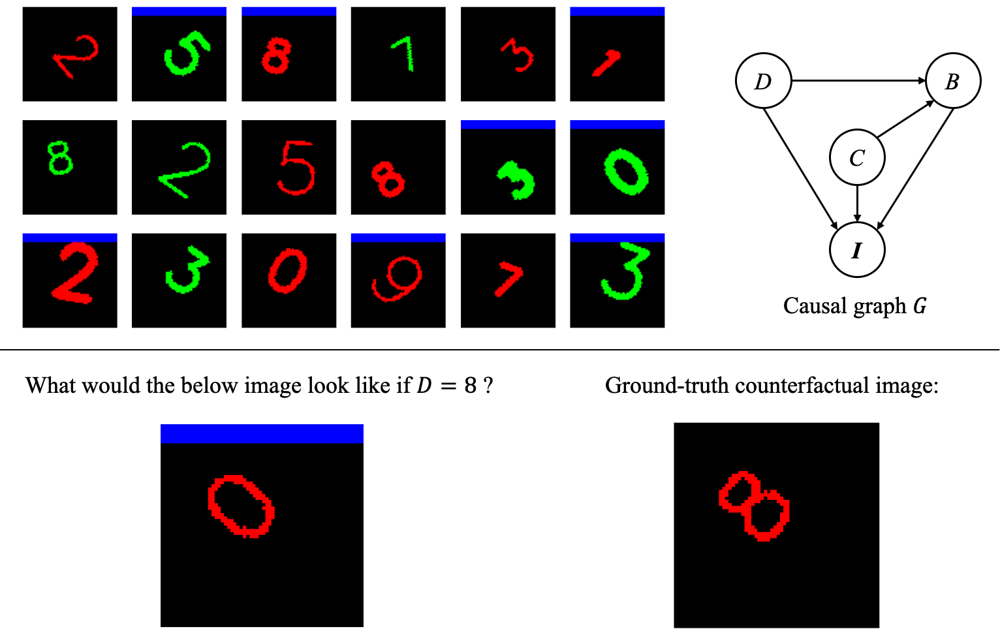

# CausalDigits
CausalDigit is a benchmark dataset consists of synthetic digit images for understanding and evaluating deep causal models for interventional and counterfactual image generation, causal representation learning, and causal discovery.

